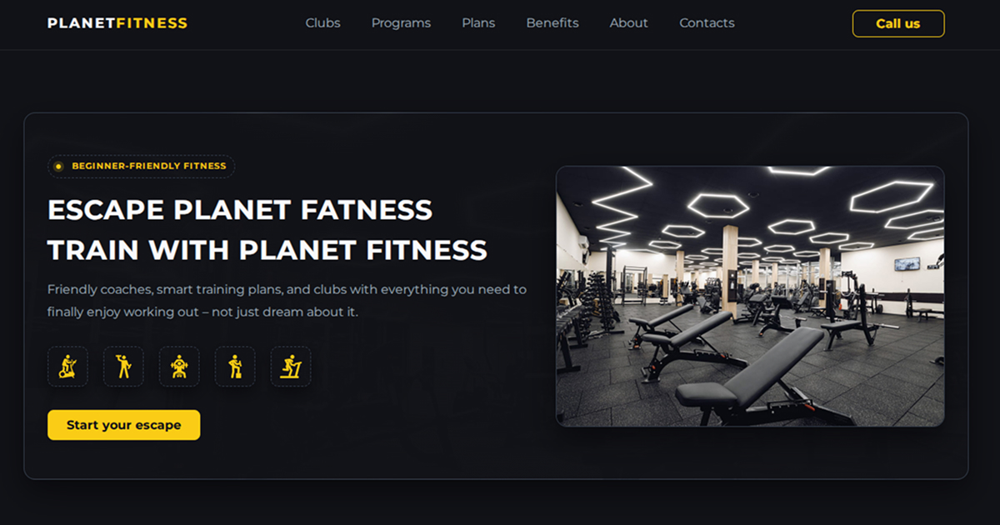

# 🌍 Planet Fitness | Escape Planet Fatness

Fully responsive landing page for a modern fitness studio

  

## 🚀 About the Project

**Planet Fitness** is a fitness studio website.

The website is fully responsive, optimized for mobile, tablet, and desktop, and
includes interactive components such as a modal form, mobile navigation menu,
and dynamic timeline steps.

---

## 🎨 Features & UI Highlights

### 💡 Modern Design

- Dark theme with vivid yellow accents
- Smooth shadows, dashed borders, neon-style icons

### 📱 Fully Responsive Layout

- Mobile-first approach
- Breakpoints at **768px** and **1158px**
- Adaptive `<picture>` images for every section

### 🧭 Smart Navigation

- Sticky header
- Fully animated mobile menu
- Smooth scroll across all sections

### 💬 Interactive Elements

- **Modal callback form** with:
  - custom inputs
  - styled select dropdown
  - animated close button
- **Timeline roadmap** showing “How to start” steps

### 🏋️ Sections Overview

- **Hero block** with training icons and CTA
- **Clubs section** with adaptive gallery
- **Membership plans** (4 options)
- **Beginner training programs** + downloadable PDFs
- **Benefits section** in card format
- **About us** with schedule
- **Contacts** with callback CTA

---

## 🖼️ Adaptive Images

Each image uses `<picture>` with 1x / 2x sources:

- `*-mobile.jpg`, `*-mobile@2x.jpg`
- `*-tab.jpg`, `*-tab@2x.jpg`
- `*-desk.jpg`, `*-desk@2x.jpg`

This ensures:

- Retina support
- Faster loading
- High Lighthouse performance

---

## 🛠️ Technologies Used

- **HTML5**
- **CSS3** (Mobile-first)
- **Modern Normalize**
- **JavaScript** (modal, mobile menu, accessibility)
- **SVG Icons** (sprite)

---

## 🧪 Performance & SEO

Project is optimized for:

- Fast load time
- Clean markup
- SEO-friendly structure
- Open Graph previews
- Custom yellow favicon

Includes:

- Title & meta description
- OG tags for social networks
- Twitter card support

---

## 👩‍💻 Author

**Natalia Skoropad**  
Frontend Developer | UX/UI Designer

- GitHub: https://github.com/natalia-skoropad
- Portfolio: https://portfolio-nataliia-skoropad.vercel.app ❤️
